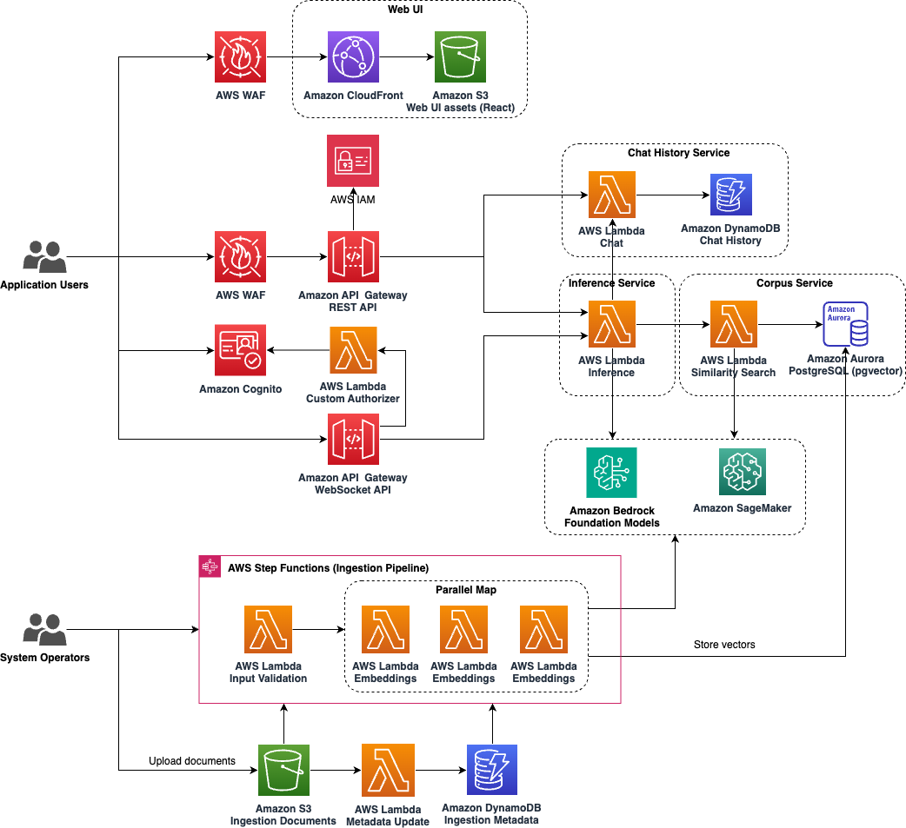

### Table of contents

-   [Francis GenAI RAG ChatBot on AWS](#francis-genai-rag-chatbot-on-aws)
-   [Key features](#key-features)
-   [Licence](#icence)
-   [Architecture overview](#architecture-overview)
    -   [Architecture reference diagram](#architecture-reference-diagram)
    -   [Solution components](#solution-components)
-   [Prerequisites](#prerequisites)
    -   [Build environment specifications](#build-environment-specifications)
    -   [AWS account](#aws-account)
    -   [Tools](#tools)
-   [How to build and deploy the solution](#how-to-build-and-deploy-the-solution)
    -   [Configuration](#configuration)
    -   [Build and deploy](#build-and-deploy)
-   [How to handle promotion-related questions](#how-to-handle-promotion-related-questions)
-   [How to ingest the documents into vector store](#how-to-ingest-the-documents-into-vector-store)
-   [Access the solution web UI](#access-the-solution-web-ui)
-   [Uninstall the solution](#uninstall-the-solution)

---

## Francis GenAI RAG ChatBot on AWS

Francis is a GenAI RAG ChatBot reference architecture provided by AWS, designed to help developers quickly prototype, deploy, and launch Generative AI-powered products and services using Retrieval-Augmented Generation (RAG). By integrating advanced information retrieval with large language models, this architecture delivers accurate, contextually relevant natural language responses to user queries.

You can use this README file to find out how to build, deploy, use and test the code. You can also contribute to this project in various ways such as reporting bugs, submitting feature requests or additional documentation. For more information, refer to the [Contributing](CONTRIBUTING.md) topic.

## Licence

Licensed under the Apache License Version 2.0 (the "License"). You may not use this file except in compliance with the License. A copy of the License is located at

    http://www.apache.org/licenses/

or in the "license" file accompanying this file. This file is distributed on an "AS IS" BASIS, WITHOUT WARRANTIES OR CONDITIONS OF ANY KIND, express or implied. See the License for the specific language governing permissions and limitations under the License.

## Key Features

1. **Document Ingestion Pipeline**: The chatbot incorporates a flexible document ingestion pipeline that can ingest and process various document formats, including but not limited to PDF, and plain text files. This feature allows you to easily incorporate existing knowledge bases or documentation into your chatbot's understanding.

1. **Postgres pgvector for Embeddings Store**: The project utilizes Postgres pgvector, a powerful extension for vector similarity searches, to store and manage document embeddings efficiently. This approach enables fast and accurate retrieval of relevant information from the ingested documents, enhancing the chatbot's ability to provide contextual and meaningful responses.

1. **AWS Bedrock and SageMaker Integration**: The chatbot seamlessly integrates with AWS Bedrock, a managed service for building and deploying machine learning models, as well as SageMaker, Amazon's fully managed machine learning service. This integration allows you to leverage pre-trained large language models hosted on Amazon Bedrock or deploy custom models trained on SageMaker, providing flexibility and scalability for your chatbot's language understanding capabilities.

1. **Interactive Chatbot Interface**: The project includes a user-friendly chatbot interface that allows users to engage in natural language conversations with the chatbot. The interface provides a seamless experience for users to ask questions, receive contextual responses, and engage in follow-up conversations.

---

## Architecture overview

### Architecture reference diagram

The following diagram represents the solution's architecture design.




### Solution components

The solution deploys the following components:

- **Web Application Firewall**: AWS WAF is utilized to safeguard web frontend and API endpoints from prevalent web vulnerabilities and automated bots that could potentially impact availability, compromise security, or overutilize resources. 

- **Amazon CloudFront Distribution**: Amazon CloudFront distribution is used to serve the ChatBot Web UI. CloudFront delivers low latency, high performance, and secure static web hosting. An Amazon Simple Storage Service (Amazon S3) web UI bucket hosts the static web application artifacts.

- **Amazon Cognito**: An Amazon Cognito user pool to provide customers a quick and convenient authentication mechanism to explore the solution’s functionalities without extensive configuration.

- **Amazon API Gateway**: It exposes a set of RESTful APIs and routes incoming requests to the backend lambda functions.

- **Chat Lambda Function**: This lambda function stores and retrieves chat messages for user's chat sessions in a DynamoDB table, enabling the maintenance of conversational context.

- **Inference Lambda Function**: The Inference Lambda Function handles user queries and provides natural language responses. It interacts with the similarity search function to retrieve relevant context information based on the user's query and fetches the user's chat session messages from the chat lambda function. By combining context retrieval, chat session awareness, and leveraging large language models, the Inference Lambda Function ensures accurate and contextually relevant answers to user queries.

- **Similarity Search Lambda Function**: The Similarity Search Lambda Function handles semantic search queries. It consults an embeddings model to convert the user's question into embeddings, a dense vector representation. Using these embeddings, the function fetches the most relevant documents from the vector store by performing a similarity search. This process ensures that the retrieved documents are highly relevant to the user's query, enabling accurate and contextual responses.

- **Chat History Data Store**: A DynamoDB table which stores the user's chat session messages.

- **Ingestion Pipeline**: An AWS Step Function that encapsulates the logic to ingest documents stored in an S3 bucket, split the documents into small chunks, convert the chunks into embeddings, and store the chunks and embeddings into the vector store.

- **Vector Store**: An Amazon Aurora PostgreSQL serverless cluster with the PGVector extension to store the chunks of documents and embeddings.

---

## Prerequisites

### Build environment specifications

-   To build and deploy this solution, we recommend using Ubuntu with minimum 4 cores CPU, 16GB RAM. Mac(Intel) or other Linux distributions are also supported.
-   The computer used to build the solution must be able to access the internet.

### AWS account

-   **A CDK bootstrapped AWS account**: You must bootstrap your AWS CDK environment in the target region you want to deploy, using the AWS CDK toolkit's cdk bootstrap command. From the command line, authenticate into your AWS account, and run `cdk bootstrap aws://<YOUR ACCOUNT NUMBER>/<REGION>`. For more information, refer to the [AWS CDK's How to bootstrap](https://docs.aws.amazon.com/cdk/v2/guide/bootstrapping.html) page.

-   **Access to Amazon Bedrock foundation models**: Access to Amazon Bedrock foundation models isn't granted by default. In order to gain access to a foundation model, an IAM user with sufficient permissions needs to request access to it through the console. Once access is provided to a model, it is available for all users in the account. To manage model access, sign into the [Amazon Bedrock console](https://console.aws.amazon.com/bedrock/). Then select Model access at the bottom of the left navigation pane.

### Tools

-   The latest version of the [AWS CLI](https://aws.amazon.com/cli/), installed and configured.
-   The latest version of the [AWS CDK](https://docs.aws.amazon.com/cdk/latest/guide/home.html).
-   [Nodejs](https://docs.npmjs.com/getting-started) version 18 or newer.
-   [Docker](https://docs.docker.com/get-docker/)

---

## How to build and deploy the solution

Before you deploy the solution, review the architecture and prerequisites sections in this guide. Follow the step-by-step instructions in this section to configure and deploy the solution into your account.

Time to deploy: approximately 20 minutes

### Configuration

Use the `bin/config.yaml` file to configure the solution. It is recommended to copy from an example in the `quickstart` folder based on the hosting platform (`Amazon Bedrock` or `Amazon SageMaker`) for the large language models, and make changes to suit your use cases accordingly.

Example:
```bash
cp quickstart/bedrock/config.yaml bin/
```

**Data retention policy configuration (optional)**

By default, all solution data (S3 buckets, Aurora DB instances, Aurora DB snapshots etc.) will be kept when you uninstall the solution. To remove this data, in the configuration file, set the `retainData` flag to `false`. You are liable for the service charges when solution data is retained in the default configuration.

```yaml
retainData: false,
```

**Application name (optional)**

An unique identifier, composed of ASCII characters, is used to support multiple deployments within the same account. The application name will be appended to the CloudFormation stack name, ensuring each CloudFormation stack remains unique.
```yaml
applicationName: <string>
```

**LLM configuration**

Specify settings for the large language models, including streaming, conversation history length, corpus document limits, similarity thresholds, and prompt configurations for standalone question rephrasing and question-answering chains.

-   **streaming (optional)**: Whether to enable streaming responses from the language model. Default is false.
    ```yaml
    streaming: <true|false>
    ```

-   **maxConversationHistory (optional)**: The maximum number of chat messages to include in the conversation history for rephrasing a follow-up question into a standalone question. Default is 5.
    ```yaml
    maxConversationHistory: <integer>
    ```

-   **maxCorpusDocuments (optional)**: The maximum number of documents to include in the context for a question-answering prompt. Default is 5.
    ```yaml
    maxCorpusDocuments: <integer>
    ```

-   **corpusSimilarityThreshold (optional)**: The minimum similarity score required for a document to be considered relevant to the question. Default is 0.25.
    ```yaml
    corpusSimilarityThreshold: <float>
    ```

-   **standaloneChainConfig (optional)**: Configuration for the standalone question rephrasing chain.  If this chain is not configured, the original user questions will be used directly for answering without any rephrasing.
    -   **modelConfig**: configuration for the language model used in this chain
        ```yaml
        modelConfig:
          provider: <the provider of the language model (e.g., bedrock, sagemaker).>
          modelId: <the ID of the language model or inference profile (e.g., anthropic.claude-3-haiku-20240307-v1:0, us.anthropic.claude-3-haiku-20240307-v1:0)>
          modelEndpointName: <the name of SageMaker endpoint if the model provider is set to sagemaker. Leave it to empty if the provider is bedrock.>
          modelKwargs: <Additional keyword arguments for the language model, such as topP, temperature etc.>
        ```

        Example:
        ```yaml
        modelConfig:
          provider: bedrock
          modelId: anthropic.claude-3-haiku-20240307-v1:0
          modelKwargs:
            maxTokens: 1024
            temperature: 0.1
            topP: 0.99
            stopSequences:
              - "Asisstant:"
        ```

        To find more information about `modelKwargs`, please refer to the [inference parameters](https://docs.aws.amazon.com/bedrock/latest/userguide/inference-parameters.html).

    -   **promptTemplate**: The prompt template used for rephrasing questions.
        ```yaml
        promptTemplate: <string>
        ```

        Example:
        ```yaml
        promptTemplate: |
          Given the following conversation and a follow up question, rephrase the follow up question to be a standalone question, in its original language. 
          If there is no chat history, just rephrase the question to be a standalone question.

        Chat History:
        ${chat_history}
        Follow Up Input: ${question}
        ```
    
    -   **promptVariables**: The list of variables used in the prompt template.
        ```yaml
        promptVariables:
          - <variable1>
          - <variable2>
        ```

        Example:
        ```yaml
        promptVariables:
          - chat_history
          - question
        ```

    -   **kwargs**: Addtional keyword arguments used in this chain.
        ```yaml
        kwargs:
          <key>: <value>
        ```
        
        Example:
        ```yaml
        kwargs:
          system_prompt: |
            You are an AI assistant. Your primary role is to assist users with a wide range of questions and tasks. However, do not provide advice or information related to buying or selling stocks, investments, or financial trading. If asked about these topics, politely decline and suggest the user consult a financial professional.
          input_label: inputs
          model_kwargs_label: parameters
          output_label: generated_text
        ```

-   **qaChainConfig**: Configuration for the question-answering chain.
    -   **modelConfig**: Configuration for the language model used in this chain (similar to standaloneChainConfig.modelConfig).
        ```yaml
        modelConfig:
          provider: <the provider of the language model (e.g., bedrock, sagemaker).>
          modelId: <the ID of the language model or inference profile (e.g., anthropic.claude-3-haiku-20240307-v1:0, us.anthropic.claude-3-haiku-20240307-v1:0)>
          modelEndpointName: <The name of the SageMaker endpoint for the language model (required for SageMaker models).>
          modelKwargs: <Additional keyword arguments for the language model, such as topP, temperature etc.>
        ```
    
    -   **promptTemplate**: The prompt template used for answering questions.
        ```yaml
        prompteTemplate: <string>
        ```
    
    -   **promptVariables**: The list of variables used in the prompt template.
        ```yaml
        promptVariables:
          - <variable1>
          - <variable2>
        ```
    
    -   **kwargs**: Addtional keyword arguments used in this chain. 
        ```yaml
        kwargs:
          <key>: <value>
        ```
        To enable promotion image handling, firstly you need to upload the document to the input bucket, and then specify the promotion image URL using the `promotion_image_url` parameter in the `kwargs`.
        ```yaml
        kwargs:
          promotion_image_url: <s3>
        ```


**RAG configuration**

-   **vectorStoreConfig**: Configuration for the vector store. Currently, it supports Amazon Aurora PostgreSQL only.
    ```yaml
    vectorStoreType: <The type of vector store used (e.g., pgvector).>
    vectorStoreProperties:
      minCapacity: <The minimum capacity (in Aurora Capacity Units) for the vector store.>
      maxCapacity: <The maximum capacity (in Aurora Capacity Units) for the vector store.>
      useRDSProxy: <Boolean flag indicating if RDS proxy is used for database connections.>
    ```

-   **embeddingsModels**: A list of embeddings models used for generating document embeddings. 
    ```yaml
    embeddingsModels:
      - provider: <The provider of the embeddings model (e.g., bedrock, sagemaker).>
        modelId: <The ID of the embeddings model.>
        modelRefKey: <A reference key for the embeddings model.>
        dimensions: <The dimensionality of the embeddings produced by the model.>
        modelEndpointName: <The name of the SageMaker endpoint for the embeddings model (required for SageMaker models).>
    ```
    If multiple embedding models are configured, the first model in the list will be chosen by default unless modelRefKey is specified.

**Chat history configuration (optional)**
By default, this solution uses DynamoDB to store chat history. Alternatively, it supports storing chat history in the same PostgreSQL database as the vector store.
```yaml
chatHistoryConfig:
  storeType: <dynamodb | aurora_postgres>
```


**AWS WAF configuration (optional)**
This solution provisions AWS WAF Web ACL for API Gateway resources, by default. For a CloudFront distribution WAF Web ACL, the solution allows users to associate their existing AWS WAF Web ACL for CloudFront with the CloudFront distribution created by the solution. Refer to the configuration options below for configuring your AWS WAF Web ACL.

```yaml
wafConfig:
  enableApiGatewayWaf: <true|false>
  cloudfrontWebAclArn: <The ARN of existing Waf WebAcl to link with CloudFront. It has to be created on us-east-1.>
  allowedExternalIpRanges: <A list of IP prefixes. e.g. 192.168.0.0/24, 10.0.0.0/8>
```

Example WAF Configuration:

```yaml
wafConfig:
  enableApiGatewayWaf: true
  allowedExternalIpRanges:
    - 192.168.0.0/24
    - 10.0.0.0/8
```

### Build and deploy

1. Open the terminal and navigate to the project root directory.
2. Configure the solution in the `bin/config.yaml` as suggested
3. Install the dependencies: `npm install`
4. Build the code: `npm run build`
5. Deploy the solution: `npm run cdk deploy -- --parameters adminUserEmail=<ADMIN_EMAIL_ADDRESS>`

---

## How to ingest the documents into vector store
This section provides instructions on how to ingest documents into the vector store using our AWS Step Function-based ingestion pipeline. 
1. Find the input bucket name from deployment output starting with `InputBucket`. Upload the documents from local directory to the input bucket.

```bash
aws s3 cp <local_dir> s3://<input_bucket>/<input_prefix>/ --recursive
```

2. Find the state machine ARN of AWS step function from the deployment output starting with `StateMachineArn`. Execute the ingestion pipeline.

```bash
aws stepfunctions start-execution --state-machine-arn <state-machine-arn>
```

Capture the ARN of execution.

3. Monitor the execution status of the Step Function through the AWS Management Console or using the AWS CLI.
```bash
aws stepfunctions describe-execution --execution-arn <execution-arn>
```

4. Review the logs generated by the Lambda functions for any errors or issues during the ingestion process. Logs can be accessed through AWS CloudWatch.


## Access the solution web UI

After the solution stack has been deployed and launched, you can sign in to the web interface.

1. Find the website URL from deployment output starting with `CloudFrontDomain` and open it in your browser. We recommend using Chrome. You will be redirected to the sign in page that requires username and password.
2. Sign in with the email address specified during deployment (`adminEmail`) and use the temporary password received via email after deployment. You will receive a temporary password from `no-reply@verificationemail.com`.
3. During the sign in, you are required to set a new password when signing in for the first time.
4. After signing in, you can view the solution's web UI.

---

## File structure

Upon successfully cloning the repository into your local development environment but prior to running the initialization script, you will see the following file structure in your editor.

```
|- lib/                       # Infrastructure and backend code
   |- infra/                  # CDK Infrastructure
   |- backend/                # Backend code
|- docs/                      # Documentation files
   |- images/                 # Documentation images and diagrams
|- frontend/                  # React ChatBot UI application
   |- src/                    # Source code files
   |- public/                 # Static assets
|- quickstart/                # Quick start configuration examples
   |- bedrock/                # Sample configuration files
|- reports/                   # Security and dependency reports
|- .gitignore                 # Git ignore file
|- LICENSE.txt                # Apache 2.0 license
|- README.md                  # Project documentation
```

---

## Uninstall the solution

You can uninstall the solution by directly deleting the stacks from the AWS CloudFormation console.

To uninstall the solution, delete the stacks from the AWSCloudFormation console

-   Go to the AWS CloudFormation console, find and delete the following stacks:
    -   All the stacks with the prefix `FrancisChatbotStack`

Alternatively, you could also uninstall the solution by running `npm run cdk destroy` from the `source` folder.

---

Copyright 2022 Amazon.com, Inc. or its affiliates. All Rights Reserved.

Licensed under the Apache License Version 2.0 (the "License"). You may not use this file except in compliance with the License. A copy of the License is located at

    http://www.apache.org/licenses/

or in the "license" file accompanying this file. This file is distributed on an "AS IS" BASIS, WITHOUT WARRANTIES OR CONDITIONS OF ANY KIND, express or implied. See the License for the specific language governing permissions and limitations under the License.
